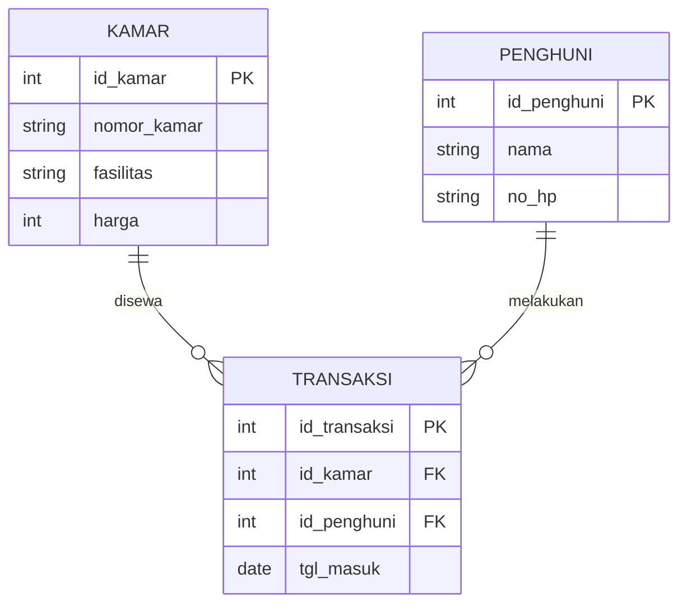

# Sistem Informasi Pengelolaan Kos

Repository ini berisi laporan jawaban UAS Basis Data mengenai rancangan database, dokumentasi ERD, normalisasi, script SQL DDL & DML, serta aplikasi CRUD berbasis Python dan PHP.

## 1. Topik yang Dipilih
**Topik:** Sistem Informasi Pengelolaan Kos.
Sistem ini dirancang untuk mengelola proses operasional kos, mulai dari pendaftaran penghuni, pengelolaan kamar, hingga pencatatan transaksi pembayaran sewa.

## 2. Proses Bisnis dan Modul
* **Modul Penghuni:** Data diri penyewa (nama, no HP).
* **Modul Kamar:** Data kamar (nomor, fasilitas, harga, status).
* **Modul Transaksi:** Pencatatan periode sewa dan pembayaran biaya sewa.

## 3. Pihak yang Terlibat
* **Penghuni:** Pendaftar dan penyewa kamar.
* **Admin/Pemilik:** Pengelola data master kamar, penghuni, dan transaksi.

## 4. Entity Relationship Diagram (ERD) & Deskripsi Entitas


**Deskripsi Entitas & Atribut:**

* **Kamar:** Menyimpan data kamar (`id_kamar`, `nomor_kamar`, `fasilitas`, `harga`).
* **Penghuni:** Menyimpan identitas penyewa (`id_penghuni`, `nama`, `no_hp`).
* **Transaksi:** Mencatat penyewaan (`id_transaksi`, `id_kamar`, `id_penghuni`, `tgl_masuk`).

## 5. Kardinalitas Hubungan Antar Entitas

* **Penghuni ke Transaksi (1:N):** Satu penghuni dapat melakukan banyak transaksi sewa.
* **Kamar ke Transaksi (1:N):** Satu kamar dapat disewa dalam banyak transaksi.

## 6. Normalisasi Database

Proses normalisasi dilakukan untuk meminimalkan redundansi data.

**B. Bentuk Normal Kedua (2NF)**
Tabel dipecah agar setiap atribut bergantung penuh pada Primary Key.

| Tabel | Atribut Utama |
| --- | --- |
| Kamar | id_kamar, nomor_kamar, fasilitas, harga |
| Penghuni | id_penghuni, nama, no_hp |
| Transaksi | id_transaksi, id_kamar, id_penghuni, tgl_masuk |

**C. Bentuk Normal Ketiga (3NF)**
Tidak ada ketergantungan transitif (atribut non-key tidak menentukan atribut non-key lainnya).

## 7. Implementasi Desain Database (DDL SQL)

```sql
CREATE DATABASE db_kos;
USE db_kos;

CREATE TABLE kamar (id_kamar INT PRIMARY KEY AUTO_INCREMENT, nomor_kamar VARCHAR(10), fasilitas VARCHAR(100), harga INT);
CREATE TABLE penghuni (id_penghuni INT PRIMARY KEY AUTO_INCREMENT, nama VARCHAR(100), no_hp VARCHAR(20));
CREATE TABLE transaksi (id_transaksi INT PRIMARY KEY AUTO_INCREMENT, id_kamar INT, id_penghuni INT, tgl_masuk DATE, FOREIGN KEY(id_kamar) REFERENCES kamar(id_kamar), FOREIGN KEY(id_penghuni) REFERENCES penghuni(id_penghuni));

```

## 8. Manipulasi Data Menggunakan SQL (DML)

```sql
-- Insert Data
INSERT INTO kamar (nomor_kamar, fasilitas, harga) VALUES ('101', 'AC, WiFi', 1500000);
-- Update Data
UPDATE kamar SET harga = 1700000 WHERE id_kamar = 1;
-- Delete Data
DELETE FROM penghuni WHERE id_penghuni = 1;

```

## 9. Aplikasi CRUD

### A. Menggunakan Python

Skrip berada di `python/crud_kos.py` menggunakan `mysql-connector-python`.

### B. Menggunakan PHP (Web MVC App)

Struktur MVC:

* **Model:** `php/models/`
* **Controller:** `php/controllers/`
* **View:** `php/views/`

---

*Dibuat untuk memenuhi tugas UAS Mata Kuliah Basis Data.*

```
